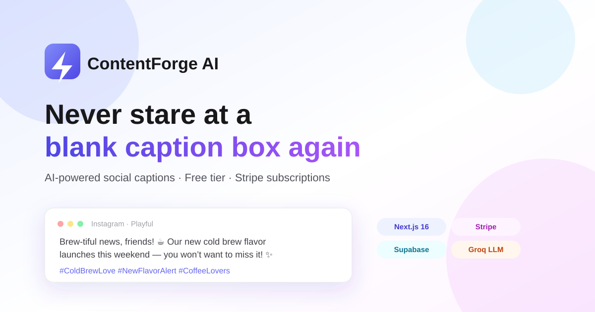

# ContentForge AI



**AI-powered social media caption generator** — describe a post, pick a platform and
tone, and get three ready-to-publish captions with hashtags in seconds.

Built as a complete, production-shaped SaaS: authentication, a usage-tracked free tier,
Stripe subscriptions, and AI-generated content, deployed live on Vercel.

**Stack:** Next.js 16 (App Router, TypeScript) · Supabase (Auth + Postgres) · Stripe · Groq (Llama 3.3) · Tailwind CSS · Vercel

---

## Features

- **Landing page** with animated hero, feature highlights, and an interactive pricing selector
- **Authentication** — email/password and Google OAuth via Supabase Auth
- **Dashboard** — generate 3 platform-specific captions (topic + platform + tone) via a Groq-hosted LLM
- **Free tier** — 5 generations/month, enforced server-side against the database (not just the UI)
- **Stripe subscriptions** — "Upgrade to Pro" opens a real Stripe Checkout session; a webhook keeps the user's plan in sync with their subscription status automatically
- **Row-level security** on every table — users can only ever read or write their own data

## Architecture

```
┌─────────────┐      ┌───────────────────┐      ┌────────────┐
│  Next.js UI │──────▶  Route Handlers    │──────▶  Supabase  │
│  (App Router)│      │  /api/generate     │      │  Postgres  │
│              │      │  /api/stripe/*     │      │  + Auth    │
└─────────────┘      └─────────┬──────────┘      └────────────┘
                                │
                       ┌────────┴────────┐
                       │  Groq (LLM)     │
                       │  Stripe API     │
                       └─────────────────┘
```

- `proxy.ts` (Next.js 16's successor to `middleware.ts`) guards `/dashboard` and refreshes
  the Supabase session on every request.
- Free-tier usage is derived by counting rows in `generations` for the current calendar
  month — no separate counter to keep in sync.
- The Stripe webhook is the single source of truth for plan status; the client never
  sets `plan = 'pro'` itself.

## Project setup

### 1. Supabase

1. Create a project at [supabase.com](https://supabase.com).
2. In the SQL Editor, run [`supabase/schema.sql`](supabase/schema.sql) — this creates the
   `profiles` and `generations` tables, row-level security policies, and a trigger that
   creates a profile automatically when a user signs up.
3. In **Authentication > URL Configuration**, set your Site URL and add
   `http://localhost:3000/auth/callback` (and your production URL's equivalent) as a
   redirect URL.
4. To enable Google sign-in: **Authentication > Providers > Google**, add your Google
   OAuth client ID/secret (from [Google Cloud Console](https://console.cloud.google.com/apis/credentials)).
5. Copy your Project URL, anon key, and service role key from **Project Settings > API**
   into `.env.local`.

### 2. Groq (AI generation)

Create a free API key at [console.groq.com/keys](https://console.groq.com/keys) — no card
required — and add it to `.env.local` as `GROQ_API_KEY`. Groq exposes an OpenAI-compatible
API, so the `openai` SDK is used with a custom `baseURL`, making it trivial to swap in
OpenAI/Anthropic later without touching the calling code.

### 3. Stripe

1. Create a Product with a recurring monthly Price (e.g. $9/mo) in the
   [Stripe Dashboard](https://dashboard.stripe.com/products). Copy the Price ID.
2. Copy your secret key from **Developers > API keys**.
3. For local webhook testing, install the [Stripe CLI](https://stripe.com/docs/stripe-cli)
   and run:
   ```bash
   stripe listen --forward-to localhost:3000/api/stripe/webhook
   ```
   This prints a webhook signing secret — put it in `STRIPE_WEBHOOK_SECRET`.
4. In production, add a webhook endpoint in the Stripe Dashboard pointing to
   `https://<your-domain>/api/stripe/webhook`, listening for `checkout.session.completed`,
   `customer.subscription.updated`, and `customer.subscription.deleted`.

### 4. Environment variables

Copy `.env.local.example` to `.env.local` and fill in the values collected above.

```bash
cp .env.local.example .env.local
```

### 5. Run locally

```bash
npm install
npm run dev
```

Open [http://localhost:3000](http://localhost:3000).

## Deploying to Vercel

1. Push this repo to GitHub.
2. Import it into [Vercel](https://vercel.com/new).
3. Add all variables from `.env.local` in the Vercel project's Environment Variables settings.
4. Update the Supabase redirect URL, Google OAuth authorized origin, and Stripe webhook
   endpoint to point at your production domain.
5. Deploy.

## Roadmap

- [ ] Stripe customer portal for self-serve plan management/cancellation
- [ ] More content types (blog outlines, product descriptions)
- [ ] Team/workspace support

## License

MIT
